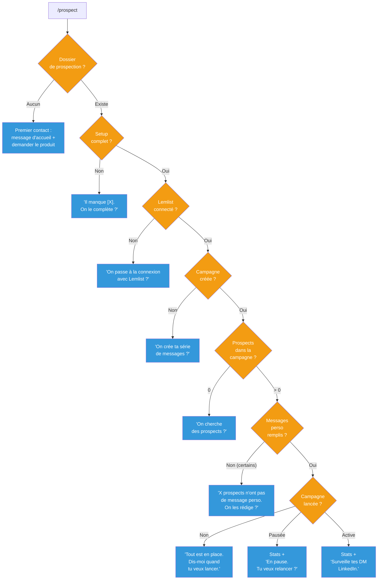

# Plugin linkedin-prospect — Vue complète

> Document de référence pour valider le plugin. Chaque information est vérifiée contre les fichiers source.

---

## Architecture du plugin

```
linkedin-prospect/
├── .claude-plugin/plugin.json     # Manifeste (nom, version, auteur)
├── .mcp.json                      # Serveur MCP Lemlist (HTTP)
├── .env                           # LEMLIST_API_KEY
├── commands/
│   └── prospect.md                # Point d'entrée unique (/prospect)
├── references/
│   ├── setup.md                   # Phase 1 : définir produit/cible/voix/arguments
│   ├── lemlist-setup.md           # Phase 2 : connecter Lemlist (OAuth)
│   ├── campaign.md                # Phase 3 : créer la campagne + séquence
│   ├── find-prospects.md          # Phase 4 : sourcer → enrichir → rédiger → ajouter
│   ├── safety-rules.md            # 7 règles non négociables
│   ├── messaging.md               # Recette de rédaction des messages
│   ├── enrichment.md              # Méthodologie d'enrichissement (tensions 1-6)
│   ├── sequence-patterns.md       # 3 patterns de séquences Lemlist
│   ├── define-product.md          # Retouche : modifier product.md
│   ├── define-icp.md              # Retouche : modifier icp.md
│   ├── define-voice.md            # Retouche : modifier voice.md
│   ├── define-arguments.md        # Retouche : modifier arguments.md
│   └── define-examples.md         # Retouche : modifier examples.md
├── agents/
│   ├── prospect-scout.md          # Agent enrichissement (max 3 recherches web)
│   └── prospect-writer.md         # Agent rédaction (messages personnalisés)
├── scripts/
│   ├── update_lead.py             # Modifier les messages d'un lead existant
│   └── audit_leads.py             # Auditer/pauser les leads incomplets
├── templates/
│   ├── product.md.tpl             # Structure cible de product.md
│   ├── icp.md.tpl                 # Structure cible de icp.md
│   ├── voice.md.tpl               # Structure cible de voice.md
│   ├── arguments.md.tpl           # Structure cible de arguments.md
│   ├── examples.md.tpl            # Structure cible de examples.md
│   ├── config.md.tpl              # Structure cible de config.md
│   └── claude.md.tpl              # CLAUDE.md créé dans chaque dossier prospect
└── docs/
    └── plans/
        └── 2026-03-08-lead-protection-design.md
```

---

## Parcours complet — Mermaid

```mermaid
flowchart TD
    START["/prospect"] --> DIAG{"Diagnostic :<br/>scanner les fichiers<br/>du dossier"}

    %% ─── PREMIER CONTACT ───
    DIAG -->|"Aucun dossier"| WELCOME["Message d'accueil :<br/>'On va construire ta prospection<br/>LinkedIn ensemble.'<br/>Demander le produit/service"]
    WELCOME --> INIT

    %% ─── SETUP ───
    DIAG -->|"Setup incomplet"| INIT_PARTIAL["'Il manque [X].<br/>On le complète ?'"]
    INIT_PARTIAL -->|"Oui"| INIT

    subgraph PHASE1 ["Phase 1 — Setup initial (init)"]
        direction TB
        INIT["📖 references/setup.md"] --> COLLECT["Collecter les sources<br/>(site web, pitch deck, profils...)"]
        COLLECT --> GENERATE["Générer 4 fichiers :<br/>product.md, icp.md,<br/>voice.md, arguments.md"]
        GENERATE --> VALIDATE_SETUP{"✋ Validation utilisateur<br/>4 choix structurants :<br/>• Le problème principal<br/>• La cible prioritaire<br/>• Le ton<br/>• L'angle principal"}
        VALIDATE_SETUP -->|"Ajuster"| GENERATE
        VALIDATE_SETUP -->|"OK"| SETUP_DONE["Setup terminé.<br/>Créer CLAUDE.md du dossier"]
    end

    SETUP_DONE --> DIAG2{"Diagnostic :<br/>Lemlist connecté ?"}

    %% ─── PREREQUIS ───
    subgraph PREREQS ["⚠️ Prérequis rappelés à l'init"]
        direction TB
        P1["Compte Lemlist nécessaire"]
        P2["Compte LinkedIn crédible :<br/>photo, connexions, historique normal.<br/>Pas neuf, pas dormant."]
    end
    INIT -.-> PREREQS

    %% ─── LEMLIST SETUP ───
    DIAG -->|"Setup OK,<br/>pas de Lemlist"| DIAG2
    DIAG2 -->|"Non connecté"| LEMLIST

    subgraph PHASE2 ["Phase 2 — Connexion Lemlist"]
        direction TB
        LEMLIST["📖 references/lemlist-setup.md"] --> TEST_MCP{"Appeler<br/>get_campaigns"}
        TEST_MCP -->|"OK"| CHECK_AUTO["⚠️ Vérifier :<br/>auto-launch = OFF"]
        TEST_MCP -->|"Erreur"| GUIDE_INSTALL["Guider l'installation<br/>OAuth pas à pas"]
        GUIDE_INSTALL --> TEST_MCP
        CHECK_AUTO --> LEMLIST_DONE["Lemlist connecté"]
    end

    %% ─── CAMPAGNE ───
    DIAG -->|"Lemlist OK,<br/>pas de campagne"| CAMPAIGN_START
    DIAG2 -->|"Déjà connecté"| CAMPAIGN_START
    LEMLIST_DONE --> CAMPAIGN_START

    subgraph PHASE3 ["Phase 3 — Création campagne"]
        direction TB
        CAMPAIGN_START["📖 references/campaign.md"] --> COLLECT_CAMP["Collecter :<br/>nom + timezone"]
        COLLECT_CAMP --> CHOOSE_SEQ{"✋ Choix séquence<br/>via AskUserQuestion :<br/>• Pattern 1 (recommandé)<br/>• Pattern 2 (contacts existants)<br/>• Pattern 3 (minimaliste)<br/>• Custom"}
        CHOOSE_SEQ --> DEFINE_VARS["Définir les messages<br/>personnalisés par prospect<br/>vs templates fixes"]
        DEFINE_VARS --> WRITE_FIXED{"✋ Rédiger + valider<br/>les templates fixes<br/>(messages identiques<br/>pour tous les prospects)"}
        WRITE_FIXED --> CREATE_MCP["Créer via MCP :<br/>1. create_campaign_with_sequence<br/>2. add_sequence_step × N<br/>3. get_campaign_sequences (vérif)"]
        CREATE_MCP --> SAVE_CONFIG["Sauvegarder config.md<br/>(campaign ID)"]
        SAVE_CONFIG --> CAMP_DONE["⛔ NE PAS LANCER<br/>'Campagne créée et en pause.'"]
    end

    %% ─── PROSPECTS ───
    DIAG -->|"Campagne OK,<br/>0 prospects"| FIND_START
    CAMP_DONE --> FIND_START

    subgraph PHASE4 ["Phase 4 — Recherche de prospects"]
        direction TB
        FIND_START["📖 references/find-prospects.md"] --> ASK_BATCH{"✋ Demander :<br/>• Combien ? (max 20)<br/>• Critères spécifiques ?<br/>• Noms/URLs déjà identifiés ?"}
        ASK_BATCH --> SOURCE["Sourcing :<br/>WebSearch × critères ICP<br/>+ vérifier contactabilité<br/>(email ou LinkedIn requis)"]
        SOURCE --> ENRICH["Enrichissement :<br/>1 agent scout par prospect<br/>(en parallèle, max 3 recherches)<br/>Feedback progressif :<br/>'✓ Nom — infos trouvées'"]
        ENRICH --> DEDUP["Dédup silencieuse<br/>via search_campaign_leads"]
        DEDUP --> WRITE_MSG["Rédaction messages :<br/>1 agent writer par prospect<br/>(en parallèle)<br/>Feedback progressif :<br/>'✓ Nom — messages rédigés'"]
        WRITE_MSG --> REVIEW_BATCH{"✋ Review batch complet<br/>(prospect + messages ensemble) :<br/><br/>① Nom — Entreprise<br/>   Raison de le contacter : ...<br/>   Message 1 : ...<br/>   Invitation : ...<br/><br/>'Valider, ajuster, ou retirer ?'"}
        REVIEW_BATCH -->|"Ajuster"| WRITE_MSG
        REVIEW_BATCH -->|"OK"| ADD_LEMLIST["Ajouter à Lemlist<br/>avec customVariables :<br/>add_lead_to_campaign({<br/>  ..., customVariables: {<br/>    m1_message, invitation_note,<br/>    enrichment_notes<br/>  }<br/>})"]
        ADD_LEMLIST --> BATCH_DONE["Batch terminé.<br/>Leads en état 'review'<br/>(pas encore envoyés)"]
    end

    BATCH_DONE --> PROPOSE_SUITE{"Proposer la suite :<br/>• Créer examples.md ?<br/>(si premier batch)<br/>• Nouveau batch ?<br/>• Lancer la campagne ?"}

    %% ─── LANCEMENT ───
    DIAG -->|"Tout prêt,<br/>pas lancé"| LAUNCH_START
    PROPOSE_SUITE -->|"Lancer"| LAUNCH_START

    subgraph PHASE5 ["Phase 5 — Lancement (review-and-start)"]
        direction TB
        LAUNCH_START["Checklist pré-lancement"] --> CHECK1["1. config.md → campaign ID"]
        CHECK1 --> CHECK2["2. get_campaign_stats<br/>→ nb leads, état campagne"]
        CHECK2 --> CHECK3["3. get_campaign_sequences<br/>→ séquence complète ?"]
        CHECK3 --> CHECK_PAUSED{"Campagne<br/>pausée ?"}
        CHECK_PAUSED -->|"Oui"| PROPOSE_RESUME["'Ta campagne est en pause.<br/>Tu veux la relancer ?'"]
        CHECK_PAUSED -->|"Non"| CHECK4
        PROPOSE_RESUME --> CHECK4
        CHECK4["4. Audit messages :<br/>audit_leads.py (filet sécurité)"]
        CHECK4 --> SUMMARY["5. Résumé pré-lancement :<br/>• X leads prêts<br/>• X leads incomplets (si > 0)<br/>• Séquence active"]
        SUMMARY --> CONFIRM{"✋ 'Tu confirmes<br/>le lancement ?'"}
        CONFIRM -->|"Non"| ABORT["Campagne reste en pause"]
        CONFIRM -->|"Oui"| LAUNCH["review_and_launch_leads<br/>→ lance les leads complets"]
        LAUNCH --> LAUNCHED["'Campagne lancée.<br/>Surveille tes DM LinkedIn<br/>pour les réponses.'"]
    end

    %% ─── MONITORING ───
    DIAG -->|"Campagne active"| STATUS
    DIAG -->|"Campagne pausée"| STATUS_PAUSED

    subgraph PHASE6 ["Phase 6 — Monitoring (status)"]
        direction TB
        STATUS["get_campaign_stats"] --> SHOW_STATS["Afficher :<br/>• État : active<br/>• Total prospects<br/>• Invitations envoyées/acceptées<br/>• Messages envoyés<br/>• Réponses<br/><br/>'Surveille tes DM LinkedIn<br/>pour les réponses.'"]
        STATUS_PAUSED["get_campaign_stats"] --> SHOW_PAUSED["Afficher stats +<br/>'Ta campagne est en pause.<br/>Tu veux la relancer ?'"]
    end

    %% ─── RETOUCHES ───
    RETOUCHE["L'utilisateur demande<br/>une modification<br/>en langage naturel"] -.->|"Modifier le produit"| RP["📖 define-product.md"]
    RETOUCHE -.->|"Modifier la cible"| RI["📖 define-icp.md"]
    RETOUCHE -.->|"Modifier le ton"| RV["📖 define-voice.md"]
    RETOUCHE -.->|"Modifier les arguments"| RA["📖 define-arguments.md"]
    RETOUCHE -.->|"Modifier les exemples"| RE["📖 define-examples.md"]
    RETOUCHE -.->|"Modifier la série<br/>de messages"| RC["📖 campaign.md"]

    %% ─── STYLES ───
    classDef danger fill:#ff6b6b,stroke:#c0392b,color:#fff
    classDef warning fill:#f39c12,stroke:#e67e22,color:#fff
    classDef safe fill:#2ecc71,stroke:#27ae60,color:#fff
    classDef user fill:#3498db,stroke:#2980b9,color:#fff
    classDef phase fill:#ecf0f1,stroke:#bdc3c7

    class CONFIRM,VALIDATE_SETUP,REVIEW_BATCH,CHOOSE_SEQ,WRITE_FIXED,ASK_BATCH user
    class CHECK_AUTO,CAMP_DONE,PREREQS danger
    class CHECK4,DEDUP,CHECK_PAUSED warning
    class LAUNCHED,SETUP_DONE,LEMLIST_DONE,BATCH_DONE safe
```



---

## Détail de chaque phase

### Phase 1 — Setup initial

| Aspect | Détail |
|--------|--------|
| **Déclencheur** | `/prospect init` ou premier contact |
| **Fichier référence** | `references/setup.md` |
| **Ce que l'utilisateur voit** | Questions sur son produit, puis 4 fichiers générés à valider |
| **Ce que l'agent fait** | Explore les sources (web, docs fournis), génère 4 fichiers depuis les templates `.tpl`, présente les choix structurants |
| **Validation requise** | 4 points : problème principal, cible prioritaire, ton, angle principal |
| **Output** | `product.md`, `icp.md`, `voice.md`, `arguments.md` + `CLAUDE.md` dans le dossier |
| **⚠️ Point d'attention** | Le dossier est créé automatiquement (ne pas demander de chemin). Prévenir tôt que le compte LinkedIn doit être crédible et qu'un compte Lemlist sera nécessaire. |
| **Critères "complet"** | `product.md` : problème + solution + différenciants. `icp.md` : 1+ segment. `voice.md` : ton décrit. `arguments.md` : 1+ angle avec preuve. |

**Exemple d'interaction premier contact :**
```
Utilisateur : /prospect
Agent : "Salut ! On va construire ta prospection LinkedIn ensemble.
         Pour commencer, dis-moi : quel produit ou service tu veux promouvoir ?"
Utilisateur : "On fait du conseil IA pour les PME industrielles"
Agent : "OK. Tu as un site web, un pitch deck, ou des messages LinkedIn existants
         que je peux regarder pour comprendre ton offre ?"
```

---

### Phase 2 — Connexion Lemlist

| Aspect | Détail |
|--------|--------|
| **Déclencheur** | Setup complet, Lemlist non connecté |
| **Fichier référence** | `references/lemlist-setup.md` |
| **Ce que l'utilisateur voit** | Guide pas-à-pas en langage clair pour connecter Lemlist |
| **Ce que l'agent fait** | Test `get_campaigns` → si KO, guide l'install OAuth → retest → vérifie auto-launch |
| **Validation requise** | Action manuelle : l'utilisateur doit ajouter le MCP dans les Settings de Claude Code |
| **Output** | MCP Lemlist connecté, auto-launch vérifié OFF |
| **⚠️ Point d'attention** | Auto-launch DOIT être OFF. Si activé, les leads démarrent la séquence sans passer par la review. C'est critique pour la sécurité du workflow. |

**Erreurs gérées :**
| Erreur | Message à l'utilisateur |
|--------|------------------------|
| "Tool not found" | "La connexion Lemlist n'est pas active. Ferme Claude Code complètement et réouvre-le." |
| "Unauthorized" | "L'autorisation a expiré. Je relance la connexion, ton navigateur va s'ouvrir." |
| "Connection refused" | "Impossible de joindre Lemlist. Vérifie ta connexion internet." |

---

### Phase 3 — Création campagne

| Aspect | Détail |
|--------|--------|
| **Déclencheur** | Lemlist connecté, pas de campagne |
| **Fichier référence** | `references/campaign.md` + `references/sequence-patterns.md` |
| **Ce que l'utilisateur voit** | Choix entre 3 patterns de séquence, puis validation des templates fixes |
| **Ce que l'agent fait** | Collecte nom/timezone, propose les patterns, crée la campagne via 3 appels MCP (create + add_steps + verify) |
| **Validations requises** | 1) Choix de séquence. 2) Validation de chaque template fixe. |
| **Output** | Campagne créée EN PAUSE dans Lemlist + `config.md` avec campaign ID |
| **⚠️ Point d'attention** | NE JAMAIS lancer la campagne ici. La campagne est créée en pause. L'utilisateur doit d'abord ajouter des prospects. |

**Les 3 patterns de séquence :**
| Pattern | Description | Quand l'utiliser |
|---------|-------------|-----------------|
| 1 (recommandé) | networkCheck → invite conditionnelle → messages + follow-ups | Prospects inconnus |
| 2 | Messages directs (pas d'invite) | Contacts déjà dans le réseau |
| 3 | Invite + 1 message unique | Approche minimaliste |

**Outils MCP utilisés :**
1. `create_campaign_with_sequence` → crée campagne + séquence principale
2. `add_sequence_step` × N → ajoute chaque étape (avec `userConfirmed: true`)
3. `get_campaign_sequences` → vérifie que tout est correct

---

### Phase 4 — Recherche de prospects

| Aspect | Détail |
|--------|--------|
| **Déclencheur** | Campagne OK, 0 prospects |
| **Fichier référence** | `references/find-prospects.md` |
| **Ce que l'utilisateur voit** | Demande de critères → feedback progressif pendant les recherches → review du batch complet (prospects + messages ensemble) |
| **Ce que l'agent fait** | Source → vérifie contactabilité → enrichit (scouts parallèles) → déduplique → rédige (writers parallèles) → review unique → ajoute avec messages |
| **Validation requise** | 1 seule review : le batch complet (prospect + messages ensemble) |
| **Output** | Leads ajoutés à Lemlist en état "review" (pas envoyés) |
| **⚠️ Points d'attention** | Max 20 par batch. Les messages sont écrits AVANT l'ajout à Lemlist. Le lead arrive complet (customVariables remplis). |

**Workflow détaillé :**

```
Étape 1 — Comprendre le besoin
├── Combien ? (max 20 par lot)
├── Critères spécifiques ?
└── Noms/URLs déjà identifiés ?

Étape 2 — Sourcing
├── WebSearch croisé avec icp.md
├── Vérifier contactabilité (email ou LinkedIn)
└── Filtrer les exclusions de icp.md (silencieusement)

Étape 3 — Enrichissement (agents scouts en parallèle)
├── Input : nom, entreprise, poste, URL LinkedIn
│          + chemin dossier prospect + chemin plugin
├── Référence : references/enrichment.md
├── Max 3 recherches web par prospect
├── Output : enrichment_notes avec tension niveau 1-6
└── Feedback : "✓ Nom — infos trouvées"

Étape 4 — Dédup
└── search_campaign_leads pour chaque prospect

Étape 5 — Rédaction (agents writers en parallèle)
├── Input : enrichissement + dossier + plugin + séquence
├── Référence : references/messaging.md
├── Output : m1_message, invitation_note, etc.
├── 6 quality checks par message
└── Feedback : "✓ Nom — messages rédigés"

Étape 6 — Review unique
├── Prospect + messages présentés ensemble
├── L'utilisateur valide, ajuste, ou retire
└── PAS de double review

Étape 7 — Ajout à Lemlist
├── add_lead_to_campaign avec customVariables
├── deduplicate: true
├── Leads arrivent en état "review" (pas envoyés)
└── ⛔ NE PAS LANCER dans la même session
```

**Exemple de review batch :**
```
━━━━━━━━━━━━━━━━━━━━━━━━━━━━━━━━━━━━━━━━━━━
BATCH — 08/03/2026
5 prospects prêts
━━━━━━━━━━━━━━━━━━━━━━━━━━━━━━━━━━━━━━━━━━━

① Marie Dupont — TechCorp (SaaS B2B)
   Raison de le contacter : recrutement de 3 devs
     en 2 mois, signe de scaling rapide
   Message 1 : "Marie, je vois que TechCorp
     accélère côté dev. Quand l'équipe double,
     les process qui tenaient craquent souvent..."
   Invitation : "Marie, je travaille avec des
     SaaS qui scalent leur équipe tech..."

② ...
━━━━━━━━━━━━━━━━━━━━━━━━━━━━━━━━━━━━━━━━━━━

Tu veux les ajouter tous, en retirer certains, ou ajuster ?
```

---

### Phase 5 — Lancement (review-and-start)

| Aspect | Détail |
|--------|--------|
| **Déclencheur** | `/prospect review-and-start` (ou `go`, `launch`, `lancer`) |
| **Fichier référence** | Section "review-and-start" dans `commands/prospect.md` |
| **Ce que l'utilisateur voit** | Résumé pré-lancement + demande de confirmation explicite |
| **Ce que l'agent fait** | 5 vérifications → résumé → confirmation → `review_and_launch_leads` |
| **Validation requise** | "Tu confirmes le lancement ?" → réponse explicite obligatoire |
| **Output** | Campagne lancée |
| **⚠️ Points d'attention** | Jamais dans la même session qu'un ajout de leads. Audit des messages comme filet de sécurité. |

**Checklist exécutée par l'agent :**
1. `config.md` → campaign ID existe ?
2. `get_campaign_stats` → combien de leads, état campagne
3. `get_campaign_sequences` → séquence complète (pas d'étapes vides) ?
4. Si pausée → proposer de relancer
5. `audit_leads.py` → filet de sécurité (vérifier variables remplies)

**Garde-fous (non négociables) :**
- ⛔ Jamais dans la même session qu'un ajout de leads
- ⛔ Jamais sans "oui" explicite dans le message courant
- ⛔ "Lance la campagne" doit être dit clairement, pas déduit

---

### Phase 6 — Monitoring (status)

| Aspect | Détail |
|--------|--------|
| **Déclencheur** | `/prospect status` ou campagne active au diagnostic |
| **Ce que l'utilisateur voit** | Stats de la campagne + conseil de surveiller les DM |
| **Ce que l'agent fait** | `get_campaign_stats` + affichage des données |

**Données affichées :** état, total prospects, invitations envoyées/acceptées, messages envoyés, réponses.

---

## Safety rules — Les 7 règles non négociables

| # | Règle | Pourquoi |
|---|-------|---------|
| 1 | **Jamais lancer automatiquement** | `review_and_launch_leads` et `set_campaign_state(start)` interdits sans approbation explicite |
| 2 | **Jamais ajouter + lancer dans la même session** | L'utilisateur doit vérifier dans Lemlist avant de lancer |
| 3 | **Review avant push** | Le batch complet doit être affiché et validé AVANT `add_lead_to_campaign` |
| 4 | **Pauser, pas supprimer** | En cas de doute → `set_campaign_state(pause)`. Jamais supprimer via MCP. |
| 5 | **Pas d'update via MCP** | Utiliser `scripts/update_lead.py` pour modifier les messages d'un lead existant |
| 6 | **Auto-launch OFF** | Si activé, les leads démarrent sans review. Lemlist envoie les variables vides sans bloquer. |
| 7 | **Leads complets avant Lemlist** | Toujours utiliser `customVariables` dans `add_lead_to_campaign`. Jamais ajouter un lead sans messages. |

---

## Table de communication — Jargon → langage clair

| Terme interne | Ce que l'utilisateur voit |
|---|---|
| custom variables | les messages personnalisés |
| séquence Lemlist | la série de messages envoyés automatiquement |
| MCP | la connexion entre Claude et Lemlist |
| agent scout/writer | je lance des recherches en parallèle |
| tension (niveau X) | la raison de contacter ce prospect maintenant |
| enrichissement | la recherche d'infos sur le prospect |
| ICP | le profil de ton client idéal |
| campaign ID | *(ne pas exposer — gérer silencieusement)* |
| leads | les prospects |
| sourcing | la recherche de prospects |
| draft | ta campagne est prête mais pas encore lancée |
| paused | ta campagne est en pause |
| active | ta campagne tourne |
| review (état lead) | en attente de lancement |

---

## Outils MCP utilisés

| Outil | Où | Usage |
|-------|-----|-------|
| `get_campaigns` | lemlist-setup | Tester la connexion |
| `get_campaign_stats` | prospect (diagnostic), find-prospects, campaign, review-and-start | Stats et état de la campagne |
| `get_campaign_sequences` | prospect (review-and-start), find-prospects, campaign, define-examples | Lire la séquence (source de vérité) |
| `create_campaign_with_sequence` | campaign | Créer la campagne |
| `add_sequence_step` | campaign | Ajouter chaque étape à la séquence |
| `add_lead_to_campaign` | find-prospects | Ajouter un lead AVEC ses messages |
| `search_campaign_leads` | find-prospects | Dédup |
| `set_campaign_state` | prospect (review-and-start) | Pauser/démarrer la campagne |
| `review_and_launch_leads` | prospect (review-and-start) | Lancer les leads après review |

---

## Scripts Python

### update_lead.py
```bash
uv run python3 "${CLAUDE_PLUGIN_ROOT}/scripts/update_lead.py" <campaign_id> "Prénom Nom" '{"m1_message": "..."}'
uv run python3 "${CLAUDE_PLUGIN_ROOT}/scripts/update_lead.py" <campaign_id> lea_xxx '{"m1_message": "..."}'
```
**Usage** : modifier les messages d'un lead déjà dans Lemlist (retouches post-ajout).
**Limite** : recherche par nom charge max 200 leads.

### audit_leads.py
```bash
# Audit seul (rapport)
uv run python3 "${CLAUDE_PLUGIN_ROOT}/scripts/audit_leads.py" <campaign_id> "m1_message,invitation_note"

# Audit + pause des incomplets
uv run python3 "${CLAUDE_PLUGIN_ROOT}/scripts/audit_leads.py" <campaign_id> "m1_message,invitation_note" --pause
```
**Usage** : filet de sécurité avant lancement. Détecte les leads sans messages via l'endpoint d'export.
**Rate limit** : pause de 2s tous les 18 appels API.

---

## Points de décision utilisateur (dans l'ordre)

| # | Moment | Question | Type |
|---|--------|----------|------|
| 1 | Premier contact | "Quel produit/service ?" | Texte libre |
| 2 | Setup phase 3 | 4 choix structurants (problème, cible, ton, angle) | AskUserQuestion |
| 3 | Campagne | Pattern de séquence (1, 2, 3, ou custom) | AskUserQuestion |
| 4 | Campagne | Validation de chaque template fixe | Review |
| 5 | Prospects | Combien + critères du batch | Texte libre |
| 6 | Prospects | Review batch complet (prospect + messages) | Review |
| 7 | Lancement | "Tu confirmes le lancement ?" | Confirmation explicite |

---

## Risques systémiques et protections

| Risque | Impact | Protection |
|--------|--------|-----------|
| Variable vide envoyée | Message cassé ("Bonjour , j'ai vu que ...") | Messages écrits AVANT ajout + customVariables + audit_leads.py |
| Auto-launch activé | Leads démarrent sans review | Vérifié au lemlist-setup + safety rule #6 |
| Lead ajouté sans messages | Message avec placeholder vide | Safety rule #7 + workflow "Complete before Lemlist" |
| Ajout + lancement même session | Pas de vérification humaine | Safety rule #2 |
| Ban LinkedIn | Compte restreint | Max 20 leads/batch + compte LinkedIn crédible |
| Content hashing LinkedIn | Messages détectés comme spam | Varier angles/stats/CTAs entre prospects du batch (messaging.md) |
| Suppression accidentelle | Perte de données irréversible | Pas de suppression via MCP — toujours le dashboard |

---

## Arbre de décision du diagnostic


